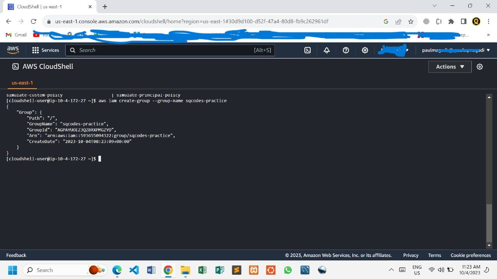
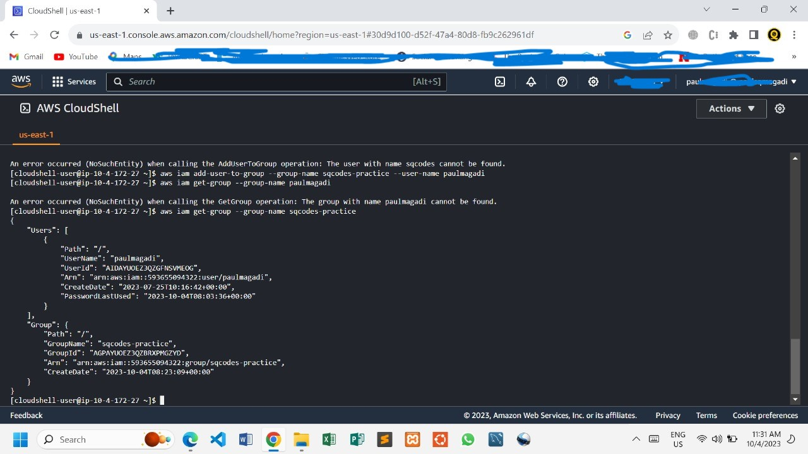

# AWS IDENTITY AND ACCESS MANAGEMENT (IAM)
<p>AWS Identity and Access Management (IAM) is a web service that helps you securely control access to AWS resources. With IAM, you can centrally manage permissions that control which AWS resources users can access. You use IAM to control who is authenticated (signed in) and authorized (has permissions) to use resources.</p>

# IAM features
<p>IAM gives you the following features:</p>

1. Shared access to your AWS account
<p>You can grant other people permission to administer and use resources in your AWS account without having to share your password or access key.</p  >

2. Granular permissions
<p>You can grant different permissions to different people for different resources. For example, you might allow some users complete access to Amazon Elastic Compute Cloud (Amazon EC2), Amazon Simple Storage Service (Amazon S3), Amazon DynamoDB, Amazon Redshift, and other AWS services. For other users, you can allow read-only access to just some S3 buckets, or permission to administer just some EC2 instances, or to access your billing information but nothing else.</p>

3. Secure access to AWS resources for applications that run on Amazon EC2
4. Multi-factor authentication (MFA)
5. Identity federation:-
`You can allow users who already have passwords elsewhere—for example, in your corporate network or with an internet identity provider—to get temporary access to your AWS account`

6. Identity information for assurance
7. PCI DSS Compliance
<p>IAM supports the processing, storage, and transmission of credit card data by a merchant or service provider, and has been validated as being compliant with Payment Card Industry (PCI) Data Security Standard (DSS)</p>

8. Integrated with many AWS services
9. Eventually Consistent

# When do I use IAM?
1. When you are performing different job functions
2. When you are authorized to access AWS resources
3. When you sign-in as an IAM user
4. When you assume an IAM role
5. When you create policies and permissions

# Permissions and policies


## Policies and users

- IAM users are identities in the service. When you create an IAM user, they can't access anything in your account until you give them permission. You give permissions to a user by creating an identity-based policy, which is a policy that is attached to the user or a group to which the user belongs. The following example shows a JSON policy that allows the user to perform all Amazon DynamoDB actions (dynamodb:*) on the Books table in the 123456789012 account within the us-east-2 Region.

```json
{
  "Version": "2012-10-17",
  "Statement": {
    "Effect": "Allow",
    "Action": "dynamodb:*",
    "Resource": "arn:aws:dynamodb:us-east-2:123456789012:table/Books"
  }
}
```

- After you attach this policy to your IAM user, the user only has those DynamoDB permissions. Most users have multiple policies that together represent the permissions for that user.

# Policies and groups
You can organize IAM users into IAM groups and attach a policy to a group. In that case, individual users still have their own credentials, but all the users in a group have the permissions that are attached to the group. Use groups for easier permissions management, and to follow our Security best practices in IAM.


# Using AWS CloudShell to work with AWS Identity and Access Management

<p>AWS CloudShell is a browser-based, pre-authenticated shell that you can launch directly from the AWS Management Console. You can run AWS CLI commands against AWS services (including AWS Identity and Access Management) using your preferred shell (Bash, PowerShell or Z shell). And you can do this without needing to download or install command line tools.</p>

<p>You launch AWS CloudShell from the AWS Management Console, and the AWS credentials you used to sign in to the console are automatically available in a new shell session. This pre-authentication of AWS CloudShell users allows you to skip configuring credentials when interacting with AWS services such as IAM using AWS CLI version 2 (pre-installed on the shell's compute environment).</p>

# Obtaining IAM permissions for AWS CloudShell

Using the access management resources provided by AWS Identity and Access Management, administrators can grant permissions to IAM users so they can access AWS CloudShell and use the environment's features.

The quickest way for an administrator to grant access to users is through an **AWS managed policy**. An `AWS managed policy` is a standalone policy that's created and administered by AWS. The following AWS managed policy for CloudShell can be attached to IAM identities:

- `AWSCloudShellFullAccess`: Grants permission to use AWS CloudShell with full access to all features.

If you want to limit the scope of actions that an IAM user can perform with AWS CloudShell, you can create a custom policy that uses the `AWSCloudShellFullAccess` managed policy as a template. For more information about limiting the actions that are available to users in CloudShell, see Managing AWS CloudShell access and usage with IAM policies in the AWS CloudShell User Guide.

# Create an IAM group and add an IAM user to the group using AWS CloudShell

The following example uses CloudShell to create an IAM group, add an IAM user to the group, and then verify that the command succeeded.

1. From the AWS Management Console, you can launch CloudShell by choosing the following options available on the navigation bar:

- Choose the CloudShell icon.
- Start typing "cloudshell" in Search box and then choose the CloudShell option.

2. To create an IAM group, enter the following command in the CloudShell command line. In this example we named the group east_coast:

```aws iam create-group --group-name east_coast```

### If the call is successful, the command line displays a response from the service similar to the following output:

```json
{
    "Group": {
        "Path": "/",
        "GroupName": "east_coast",
        "GroupId": "AGPAYBDBW4JBY3EXAMPLE",
        "Arn": "arn:aws:iam::111122223333:group/east_coast",
        "CreateDate": "2023-09-11T21:02:21+00:00"
    }
}
```


        
3. To add a user to the group that you created, use the following command, specifying the group name and username. In this example we named the group east_coast and the user johndoe:

```aws iam add-user-to-group --group-name east_coast --user-name johndoe```

4. To verify that the user is in the group, use the following command, specifying the group name. In this example we continue using the group east_coast :

```aws iam get-group --group-name east_coast```

### If the call is successful, the command line displays a response from the service similar to the following output:

```json
{
    "Users": [
    {
        "Path": "/",
        "UserName": "johndoe",
        "UserId": "AIDAYBDBW4JBXGEXAMPLE",
        "Arn": "arn:aws:iam::552108220995:user/johndoe",
        "CreateDate": "2023-09-11T20:43:14+00:00",
        "PasswordLastUsed": "2023-09-11T20:59:14+00:00"
    }
    ],
    "Group": {
        "Path": "/",
        "GroupName": "east_coast",
        "GroupId": "AGPAYBDBW4JBY3EXAMPLE",
        "Arn": "arn:aws:iam::111122223333:group/east_coast",
        "CreateDate": "2023-09-11T21:02:21+00:00"
    }
}
```


        
# Security best practices in IAM

1. Require human users to use federation with an identity provider to access AWS using temporary credentials
2. Require workloads to use temporary credentials with IAM roles to access AWS
3. Require multi-factor authentication (MFA)
4. Update access keys when needed for use cases that require long-term credentials
5. Safeguard your root user credentials and don't use them for everyday tasks
6. Apply least-privilege permissions
7. Get started with AWS managed policies and move toward least-privilege permissions
8. Use IAM Access Analyzer to generate least-privilege policies based on access activity
9. Regularly review and remove unused users, roles, permissions, policies, and credentials
10. Use conditions in IAM policies to further restrict access
11. Verify public and cross-account access to resources with IAM Access Analyzer
12. Use IAM Access Analyzer to validate your IAM policies to ensure secure and functional permissions
13. Establish permissions guardrails across multiple accounts
14. Use permissions boundaries to delegate permissions management within an account